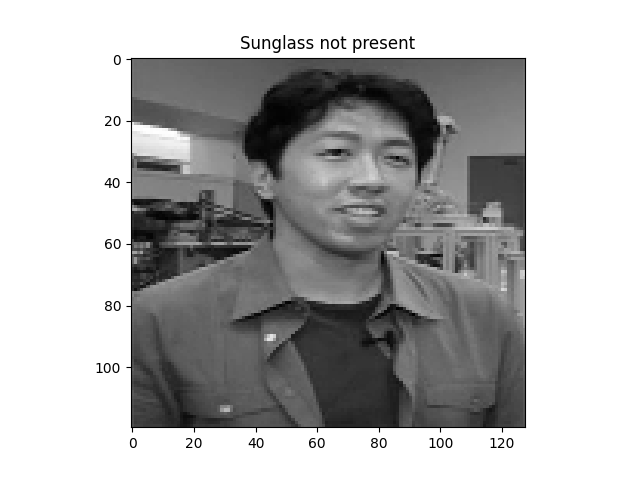
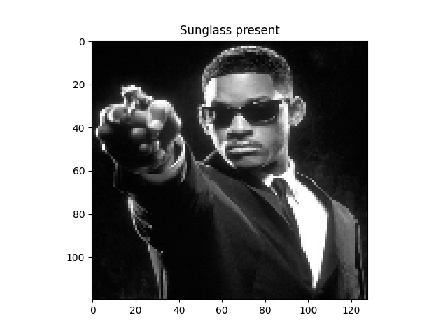

[Link for all trained model files](https://drive.google.com/drive/folders/1-juc-o1IevhL_FL7CcbjUjeFYctu8eYL?usp=sharing)

 
 

	<b>Intermediate Model results : 99.47% Validation accuracy</b>

  

	<b>Intermediate Model predictions:</b>

	
 

Sunglasses not present         |  Sunglasses present
:-------------------------:|:-------------------------:
  |  

 
 
 

	<b>Advanced model (I could do only position and sunglasses , not able to train expression part )</b>

 

Sunglass model : 99% accuracy           |  Position model 96% accuracy
:-----------------------------------:|:------------------------------:
  |  

